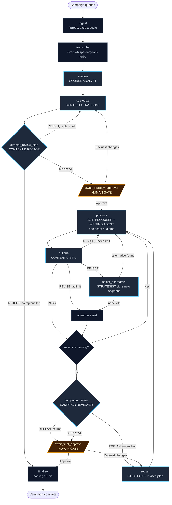

# Chorus MVP - Build Specification

Companion to `PRD.md`. The PRD says *what* and *why*. This document says *what exactly gets built, with which tools, in which order*.

**Status:** Phase 9 complete
**Last updated:** 2026-08-10

---

## 0. Locked decisions

These were decided up front. Do not relitigate them mid-build.

| Area | Decision | Why |
|---|---|---|
| Language | TypeScript everywhere | One repo, one language, one deploy story. Lower friction for anyone cloning it. |
| Framework | Next.js 16 (App Router) + Tailwind 4 + shadcn/ui | Stated preference. Server route handlers double as the API layer. |
| Orchestration | Hand-written state machine with LLM decisions at nodes | Deterministic edges, non-deterministic content. Debuggable and reliably demoable. |
| LLM access | OpenRouter (single key, multiple models) | One account, model swapping via env var. |
| Transcription | Groq `whisper-large-v3-turbo` | Word-level timestamps, ~$0.04/hr, ~60s for a 90 minute file. |
| Database | Supabase Postgres (cloud free tier) | Managed Postgres, no Docker, trivial to deploy later. |
| Video | Full render: cut + 9:16 crop + burned word-level captions | The strongest single demo moment. |
| Source media | **Video-primary.** MP3/WAV accepted but take a degraded path | Short-form platforms need a video file either way, so audio must still render one. See section 9.1. |
| Long jobs | Standalone Node worker process, polls a claim queue | No serverless timeout ceiling. Survives a 20 minute campaign run. |
| Live updates | Server-Sent Events from a Next.js route handler | Keeps all DB credentials server-side. No RLS gymnastics. |
| Deploy | Local only for v1 | Ship the agent system first. |

### Deliberately deferred

Everything in PRD section 22, plus: multi-user auth, cloud deploy, Supabase Realtime, face-tracking crop, B-roll, queue infrastructure (Trigger.dev / Inngest / Temporal), LangGraph.

---

## 1. Definition of done

The MVP is complete when, on a clean machine with `npm install` and four env vars, a user can:

1. Upload a 30 to 120 minute MP4/MOV/MP3/WAV file and type a growth objective.
2. Watch a live agent graph light up node by node as work progresses.
3. Approve or reject an autonomously generated content strategy before any expensive generation runs.
4. See at least one Critic `REVISE` decision cause a real regeneration, visible in the timeline.
5. See the Campaign Reviewer detect cross-asset repetition and force a replacement.
6. Play a rendered 9:16 MP4 with burned captions in the browser.
7. Download a zip containing the clips, the written assets as markdown, and a campaign summary.

Plus the two non-negotiable correctness properties from PRD section 27:
- Rendered clip boundaries match the timestamps the Clip Producer selected (verified by an automated test).
- No asset marked `rejected` or `abandoned` appears in the final package.

---

## 2. Prerequisites and pinned stack

```bash
brew install ffmpeg-full
/opt/homebrew/opt/ffmpeg-full/bin/ffmpeg -version  # 8.1.2, includes libass
node -v            # v24.14.0  (Next.js 16 requires >= 20.9.0)
npm -v             # 11.9.0
```

Accounts needed: **OpenRouter** (key provided later), **Groq** (free tier), **Supabase** (free tier).

### Dependency versions

Every version below was read from the npm registry `latest` dist-tag on **2026-08-09**. All are stable releases, not pre-release tags. Re-verify before Phase 0 if you start more than a few weeks from that date.

| Package | Version | Notes |
|---|---|---|
| `next` | 16.3.0 | Turbopack is the default bundler. Route `params` is a Promise and must be awaited. |
| `react` / `react-dom` | 19.2.8 | |
| `typescript` | ~~7.0.2~~ **6.0.3** | Downgraded in Phase 0: TS 7 breaks ESLint. See the caveat below. |
| `tailwindcss` | 4.3.3 | CSS-first config. There is no `tailwind.config.js`. |
| `@tailwindcss/postcss` | 4.3.3 | The v4 PostCSS plugin. |
| `ai` | 7.0.58 | Vercel AI SDK v7. |
| `@openrouter/ai-sdk-provider` | 3.0.0 | Requires `ai@^7` and `zod@^3.25.76 \|\| ^4.1.8`. |
| `zod` | 4.4.3 | Satisfies the provider's peer range. |
| `@supabase/supabase-js` | 2.112.2 | |
| `groq-sdk` | 1.5.0 | |
| `@xyflow/react` | 12.11.2 | Live agent graph. |
| `tsx` | 4.23.11 | Runs the worker. |

The dependency graph is coherent: `@openrouter/ai-sdk-provider@3` peers on `ai@^7`, which peers on `zod@^4.1.8`, and 4.4.3 satisfies it. No version pinning gymnastics required.

### Three version-specific gotchas

**TypeScript 7 removes `baseUrl`.** The Go-native compiler dropped it, along with `outFile`, `target: ES5`, `moduleResolution: node10`, and AMD/UMD/System modules. Older `create-next-app` templates emit `"baseUrl": "."` alongside `paths`. If yours does, delete the `baseUrl` line and keep `paths` (resolved relative to `tsconfig.json`) with `"moduleResolution": "bundler"`. Next.js 16 only requires TypeScript >= 5.1, so it has no upper bound blocking v7.

The one honest caveat: the typescript-go language service is still listed as "in progress" (nearly all features implemented) and its programmatic compiler API is "not ready." We never touch the compiler API, so the only exposure is editor smoothness. If your editor misbehaves, dropping to `typescript@6.0.2` is a one-line change with no code impact.

**Correction, found in Phase 0. The stack now pins `typescript@6.0.3`, not 7.0.2.** The exposure is wider than editor smoothness: `typescript-eslint` does not support TS 7.0 and throws on load, which takes `eslint-config-next` down with it, so `npm run lint` fails outright. `npx tsc --noEmit` and `next build` are unaffected. An npm `overrides` entry does not help, because the conflict is on a `peerOptional` that npm resolves at the root. Faced with "TypeScript 7 and no linting" or "TypeScript 6 and a working lint", Phase 0 chose the lint. Nothing in the codebase changed; it is a one-line version bump, reversible the moment [typescript-eslint#10940](https://github.com/typescript-eslint/typescript-eslint/issues/10940) lands.

The two TS 7 rules below still hold, because they cost nothing and keep the upgrade path open: no `baseUrl`, and `moduleResolution: bundler`.

**Tailwind 4 has no JS config file.** Configuration is CSS-first. `globals.css` starts with `@import "tailwindcss";` and design tokens are declared in an `@theme { }` block. `postcss.config.mjs` uses `@tailwindcss/postcss`. Do not go looking for `tailwind.config.js` and do not let an agent generate one; it will be silently ignored.

**AI SDK 7 supersedes `generateObject`.** See section 7.0.

---

## 3. Environment

`.env.example`:

```bash
# --- LLM (OpenRouter) ---
OPENROUTER_API_KEY=
# Verify current IDs at https://openrouter.ai/models before first run.
MODEL_REASONING=anthropic/claude-sonnet-4.5   # Director, Strategist, Critic, Campaign Reviewer
MODEL_FAST=google/gemini-2.5-flash            # Source Analyst map pass, cheap bulk work
MODEL_VISION=anthropic/claude-sonnet-4.5      # Clip frame inspection; video sources only

# --- Transcription ---
GROQ_API_KEY=

# --- Supabase ---
NEXT_PUBLIC_SUPABASE_URL=
SUPABASE_SERVICE_ROLE_KEY=    # server + worker only, never shipped to the browser

# --- Local media ---
STORAGE_DIR=./storage         # source uploads and render scratch space
# `brew install ffmpeg-full`: regular Homebrew ffmpeg omits the libass caption filter.
FFMPEG_PATH=/opt/homebrew/opt/ffmpeg-full/bin/ffmpeg
FFPROBE_PATH=/opt/homebrew/opt/ffmpeg-full/bin/ffprobe

# --- Guardrails ---
MAX_REVISIONS_PER_ASSET=3
MAX_CAMPAIGN_REPLANS=2
MAX_ASSETS=6
DEFAULT_CREDIT_BUDGET=12
CAMPAIGN_COST_CEILING_USD=3.00
```

**Storage split, and why.** Supabase free tier caps a single upload at 50 MB, and a 90 minute MP4 is 1 to 3 GB. So:

- **Source media** stays on local disk at `$STORAGE_DIR/uploads/{campaignId}/source.mp4`.
- **Rendered clips** (5 to 20 MB each) go to Supabase Storage bucket `assets`, so the UI can stream them by URL.
- **Everything structured** lives in Supabase Postgres.

This is the one place the "local only" and "Supabase" decisions interact. It is intentional, not an oversight.

---

## 4. Repository layout

```
chorus/
├── app/
│   ├── page.tsx                          # new campaign form
│   ├── campaigns/[id]/page.tsx           # live dashboard
│   ├── campaigns/[id]/review/page.tsx    # final campaign
│   └── api/
│       ├── campaigns/route.ts            # POST create + enqueue
│       ├── campaigns/[id]/route.ts       # GET full state snapshot
│       ├── campaigns/[id]/events/route.ts# GET  SSE stream
│       ├── campaigns/[id]/approve/route.ts
│       ├── campaigns/[id]/export/route.ts# GET  zip download
│       └── upload/route.ts               # streams file to STORAGE_DIR
├── lib/
│   ├── agents/
│   │   ├── director.ts
│   │   ├── source-analyst.ts
│   │   ├── strategist.ts
│   │   ├── clip-producer.ts
│   │   ├── writer.ts
│   │   ├── critic.ts
│   │   └── campaign-reviewer.ts
│   ├── graph/
│   │   ├── machine.ts                    # node registry + edge resolution
│   │   ├── nodes.ts                      # one function per node
│   │   ├── types.ts                      # NodeId, CampaignState
│   │   └── run.ts                        # the executor loop
│   ├── tools/                            # the ONLY path agents take to the world
│   │   ├── index.ts
│   │   ├── transcript.ts
│   │   ├── segments.ts
│   │   ├── video.ts
│   │   └── assets.ts
│   ├── media/
│   │   ├── ffmpeg.ts                     # exec wrapper, probe, cut, crop, burn
│   │   ├── subtitles.ts                  # word timestamps -> .ass
│   │   └── transcribe.ts                 # Groq, with chunking
│   ├── llm/
│   │   ├── client.ts                     # OpenRouter via Vercel AI SDK
│   │   ├── structured.ts                 # Output.object + Zod-error repair fallback
│   │   └── budget.ts                     # token/cost accounting + ceiling
│   ├── db/
│   │   ├── client.ts                     # service-role Supabase client
│   │   └── schema.sql
│   └── events.ts                         # emit() -> agent_events
├── worker/
│   └── index.ts                          # claim loop, runs the graph
├── components/
│   ├── AgentGraph.tsx                    # live DAG view
│   ├── AgentTimeline.tsx
│   ├── StrategyPanel.tsx
│   ├── AssetCard.tsx
│   └── ApprovalGate.tsx
├── docs/
│   └── ARCHITECTURE.md                   # mirrors section 6 diagram, kept current
├── supabase/migrations/
└── storage/                              # gitignored
```

Run with two processes: `npm run dev` (Next.js) and `npm run worker` (`tsx watch worker/index.ts`).

---

## 5. Data model

Applied as `supabase/migrations/0001_init.sql`. Conventions: `uuid` primary keys (they appear in URLs and get passed to agents), `timestamptz` never bare `timestamp`, `text` + check constraint instead of enum types (cheaper to alter), foreign keys indexed.

```sql
-- ============ campaigns ============
create table public.campaigns (
  id                  uuid primary key default gen_random_uuid(),
  title               text,
  goal                text not null,
  audience            text,
  brand_voice         text,
  platforms           text[] not null default '{tiktok,x,linkedin}',
  max_assets          int  not null default 6,
  -- Aggregate allowance shared by all final short-video assets, not per clip.
  max_video_seconds   int  not null default 120,
  credit_budget       int  not null default 12,
  credits_spent       int  not null default 0,
  cost_usd            numeric(10,4) not null default 0,

  source_path         text,
  source_duration_sec numeric,
  has_video_stream    boolean,

  status              text not null default 'queued'
    check (status in ('queued','ingesting','transcribing','analyzing','strategizing',
                      'awaiting_strategy_approval','producing','critiquing',
                      'campaign_review','awaiting_final_approval','complete','failed','cancelled')),
  current_node        text,
  replan_count        int not null default 0,
  error               text,

  claimed_at          timestamptz,
  claimed_by          text,
  heartbeat_at        timestamptz,

  created_at          timestamptz not null default now(),
  updated_at          timestamptz not null default now()
);
create index campaigns_status_idx on public.campaigns (status, created_at);

-- ============ transcript ============
create table public.transcripts (
  campaign_id uuid primary key references public.campaigns(id) on delete cascade,
  text        text not null,
  words       jsonb not null,          -- [{ w, s, e }]  seconds, float
  language    text,
  provider    text not null default 'groq/whisper-large-v3-turbo',
  created_at  timestamptz not null default now()
);

-- ============ segments ============
create table public.segments (
  id            uuid primary key default gen_random_uuid(),
  campaign_id   uuid not null references public.campaigns(id) on delete cascade,
  start_time    numeric not null,
  end_time      numeric not null,
  transcript    text not null,
  topic         text not null,
  summary       text,
  content_type  text not null
    check (content_type in ('personal_story','opinion','advice','educational',
                            'humor','quote','tangent','filler')),
  energy            numeric check (energy between 0 and 1),
  standalone_score  numeric check (standalone_score between 0 and 1),
  novelty_score     numeric check (novelty_score between 0 and 1),
  potential_hooks   text[] not null default '{}',
  context_deps      text,
  created_at        timestamptz not null default now(),
  constraint segments_time_valid check (end_time > start_time)
);
create index segments_campaign_idx on public.segments (campaign_id, start_time);

-- ============ strategy (versioned; replans create v2, v3) ============
create table public.strategies (
  id              uuid primary key default gen_random_uuid(),
  campaign_id     uuid not null references public.campaigns(id) on delete cascade,
  version         int  not null,
  rationale       text not null,
  selected_topics jsonb not null,
  rejected_topics jsonb not null,   -- [{ topic, reason }]  <- shown in the UI, do not drop
  planned_assets  jsonb not null,   -- [{ plan_key, type, platform, topic, purpose, segment_ids, credits }]
  approved_by     text check (approved_by in ('director','human')),
  created_at      timestamptz not null default now(),
  unique (campaign_id, version)
);
create index strategies_campaign_idx on public.strategies (campaign_id);

-- ============ assets ============
create table public.assets (
  id                 uuid primary key default gen_random_uuid(),
  campaign_id        uuid not null references public.campaigns(id) on delete cascade,
  plan_key           text not null,
  type               text not null check (type in ('short_video','x_thread','linkedin_post')),
  platform           text not null check (platform in ('tiktok','x','linkedin')),
  source_segment_ids uuid[] not null default '{}',

  hook               text,
  content            jsonb,   -- text: {body} | {tweets:[]} ; video: {hook,caption,clip_start,clip_end}
  media_url          text,    -- Supabase Storage public URL
  media_path         text,    -- local render path
  duration_sec       numeric,

  status             text not null default 'planned'
    check (status in ('planned','generating','needs_review','revising',
                      'passed','rejected','abandoned','replaced')),
  revision_count     int not null default 0,
  created_at         timestamptz not null default now(),
  updated_at         timestamptz not null default now(),
  unique (campaign_id, plan_key)
);
create index assets_campaign_idx on public.assets (campaign_id, status);

-- ============ per-asset reviews ============
create table public.reviews (
  id             uuid primary key default gen_random_uuid(),
  asset_id       uuid not null references public.assets(id) on delete cascade,
  campaign_id    uuid not null references public.campaigns(id) on delete cascade,
  reviewer_agent text not null default 'content_critic',
  scores         jsonb not null,  -- {hook,clarity,standalone,originality,audience_fit,payoff}
  feedback       text not null,
  decision       text not null check (decision in ('PASS','REVISE','REJECT')),
  revision_index int  not null default 0,
  created_at     timestamptz not null default now()
);
create index reviews_asset_idx on public.reviews (asset_id, created_at);
create index reviews_campaign_idx on public.reviews (campaign_id);

-- ============ campaign-level reviews ============
create table public.campaign_reviews (
  id              uuid primary key default gen_random_uuid(),
  campaign_id     uuid not null references public.campaigns(id) on delete cascade,
  version         int not null,
  scores          jsonb not null,  -- {asset_quality,diversity,audience_fit,brand_consistency,overall}
  problems        jsonb not null default '[]',
  recommendations jsonb not null default '[]',
  decision        text not null check (decision in ('APPROVE','REPLAN')),
  created_at      timestamptz not null default now()
);
create index campaign_reviews_campaign_idx on public.campaign_reviews (campaign_id);

-- ============ agent runs (one per LLM invocation) ============
create table public.agent_runs (
  id           uuid primary key default gen_random_uuid(),
  campaign_id  uuid not null references public.campaigns(id) on delete cascade,
  agent        text not null,
  node         text not null,
  input        jsonb,
  output       jsonb,
  tool_calls   jsonb not null default '[]',
  model        text,
  prompt_tokens     int,
  completion_tokens int,
  cost_usd     numeric(10,6),
  status       text not null default 'running' check (status in ('running','succeeded','failed')),
  error        text,
  started_at   timestamptz not null default now(),
  finished_at  timestamptz
);
create index agent_runs_campaign_idx on public.agent_runs (campaign_id, started_at);

-- ============ event log (drives SSE + timeline + graph) ============
create table public.agent_events (
  id           bigint generated always as identity primary key,  -- monotonic SSE cursor
  campaign_id  uuid not null references public.campaigns(id) on delete cascade,
  agent_run_id uuid references public.agent_runs(id) on delete set null,
  agent        text not null,
  node         text,
  level        text not null default 'info'
    check (level in ('info','decision','tool','warn','error')),
  message      text not null,
  data         jsonb,
  created_at   timestamptz not null default now()
);
create index agent_events_cursor_idx on public.agent_events (campaign_id, id);

-- ============ security ============
-- RLS on with zero policies = deny all. Browser never touches Postgres directly;
-- every read goes through a Next.js route handler holding the service role key,
-- which bypasses RLS by design. Adding real auth later means adding policies,
-- not restructuring access.
alter table public.campaigns        enable row level security;
alter table public.transcripts      enable row level security;
alter table public.segments         enable row level security;
alter table public.strategies       enable row level security;
alter table public.assets           enable row level security;
alter table public.reviews          enable row level security;
alter table public.campaign_reviews enable row level security;
alter table public.agent_runs       enable row level security;
alter table public.agent_events     enable row level security;
```

---

## 6. Agent graph

**This diagram is the source of truth for control flow.** Any change to `lib/graph/nodes.ts` updates this diagram and `docs/ARCHITECTURE.md` in the same commit. `components/AgentGraph.tsx` renders the same node set live.



### Node contract

Every node is the same shape. This is what makes the machine testable.

```ts
// lib/graph/types.ts
export type NodeId =
  | 'ingest' | 'transcribe' | 'analyze' | 'strategize' | 'director_review_plan'
  | 'await_strategy_approval' | 'produce' | 'critique' | 'select_alternative'
  | 'abandon_asset' | 'campaign_review' | 'replan' | 'await_final_approval'
  | 'finalize' | 'failed';

export interface NodeResult {
  next: NodeId | null;        // null = pause (human gate) or terminal
  patch?: Partial<CampaignRow>;
  reason: string;             // written to agent_events as level:'decision'
}

export type NodeFn = (ctx: RunContext) => Promise<NodeResult>;
```

The executor in `lib/graph/run.ts`:

```ts
while (node && !paused) {
  await emit({ level: 'info', node, message: `entering ${node}` });
  await db.update('campaigns', { current_node: node });
  const result = await NODES[node](ctx);
  await emit({ level: 'decision', node, message: result.reason });
  node = result.next;
  if (!node) break;                 // human gate or terminal
  await assertBudget(ctx);          // throws -> failed
}
```

Human gates set `status = 'awaiting_*'` and return `next: null`. The approve route handler flips status back to `queued` with a resume node, and the worker picks it up again. Resumability falls out of storing `current_node` in the row rather than in worker memory.

---

## 7. Agent specifications

### 7.0 Structured output on AI SDK 7

Every schema in this section is a Zod 4 schema. How it reaches the model changed in AI SDK 7, and this is the single API decision that touches all seven agents, so settle it in the Phase 0 spike before writing any agent.

AI SDK 7 introduces `Output.object({ schema })` passed to `generateText` as the replacement for the standalone `generateObject` call:

```ts
import { generateText, Output } from 'ai';
import { createOpenRouter } from '@openrouter/ai-sdk-provider';

const openrouter = createOpenRouter({ apiKey: process.env.OPENROUTER_API_KEY! });

const result = await generateText({
  model: openrouter(process.env.MODEL_REASONING!),
  output: Output.object({ schema: StrategySchema }),
  prompt,
});
```

`generateObject` still ships in 7.x and returns `result.object`. **Build the Phase 0 spike against both, confirm the result property name for the `Output.object` path, then commit to one and wrap it in `lib/llm/structured.ts` so no agent ever calls the SDK directly.** That wrapper is why this decision stays cheap: if the API shifts again, one file changes instead of seven.

A second thing to verify in the same spike: OpenAI-compatible providers default `supportsStructuredOutputs` to `false`, which means JSON schemas are not sent as strict `json_schema` and the model is merely asked nicely for JSON. Check whether the OpenRouter provider enables it, and whether your chosen model honors it. If either answer is no, the repair fallback below is not optional, it is the primary path.

`lib/llm/structured.ts` must therefore implement: attempt structured call, on parse or validation failure retry once with the Zod error injected into the prompt, then fail the node. Build this in Phase 0. You will need it.

Shared rules:
- Every agent goes through `lib/llm/structured.ts` with a Zod schema. No free-form JSON parsing in the happy path, and no direct SDK calls from agent files.
- Every agent invocation writes one `agent_runs` row with input, output, model, tokens, and cost.
- Agents read and write the world **only** through `lib/tools/`. No agent imports the Supabase client.
- Every prompt ends with the campaign goal, audience, and brand voice. Every agent knows what it is optimizing for.

### 7.1 Source Analyst

**Model:** `MODEL_FAST` for the map pass, `MODEL_REASONING` for the reduce pass.
**Problem:** a 90 minute transcript is roughly 120k to 180k tokens. Do not send it as one call.

**Map:** split the transcript into ~8 minute windows with 60 second overlap. Per window, extract candidate segments. **Reduce:** send only the extracted segments (compact, a few thousand tokens) to the reasoning model to deduplicate across window boundaries, drop filler, and score globally. Global scoring matters because `novelty_score` is meaningless within a single window.

```ts
const SegmentSchema = z.object({
  start_time: z.number(), end_time: z.number(),
  topic: z.string(), summary: z.string(),
  content_type: z.enum(['personal_story','opinion','advice','educational','humor','quote','tangent','filler']),
  energy: z.number().min(0).max(1),
  standalone_score: z.number().min(0).max(1),   // comprehensible with zero prior context?
  novelty_score: z.number().min(0).max(1),
  potential_hooks: z.array(z.string()).max(3),
  context_deps: z.string().nullable(),          // what a viewer must already know
});
```

Target 10 to 20 surviving segments. Emit `"Found N candidate topics"` as a decision event; the demo opens on that line.

### 7.2 Content Strategist

**Model:** `MODEL_REASONING`. **Input:** all segments (scores only, plus 200 char summaries), goal, audience, platforms, credit budget, max assets, and the campaign-wide maximum total video seconds.

Must output rejections with reasons. The rejected list is a first-class UI element and one of the clearest proofs the system is deciding rather than executing.

```ts
const StrategySchema = z.object({
  rationale: z.string(),
  planned_assets: z.array(z.object({
    plan_key: z.string(),                       // stable: "asset_1"
    type: z.enum(['short_video','x_thread','linkedin_post']),
    platform: z.enum(['tiktok','x','linkedin']),
    topic: z.string(), purpose: z.string(),
    segment_ids: z.array(z.string()).min(1),
    credits: z.number().int(),
  })).min(2),
  rejected_topics: z.array(z.object({ topic: z.string(), reason: z.string() })).min(1),
});
```

Validate in code, not in the prompt: `sum(credits) <= planning budget`, `count <= max_assets`, and the sum of bounded planned short-video durations must be at or below the campaign-wide `max_video_seconds`. Written assets do not consume video seconds. On violation, feed the specific violation back and retry once, then fail the node. LLMs do arithmetic badly; the constraint is enforced by the runtime.

Costs: clip 3, thread 2, LinkedIn post 2, regeneration 1.

The planning budget is not the whole campaign budget. `lib/credit-budget.ts` holds back `CRITIQUE_RESERVE_RATIO` of `credit_budget` for the critique loop, which pays 1 per regeneration and full price for a replacement asset while the rejected one keeps what it already spent. The Strategist only ever sees the planning share. The reserve yields when it would drop the planning budget below the two assets the contract requires.

Running out mid-portfolio abandons the affected asset and continues; it is a planning outcome, not a campaign failure. `produce`, `critique`, and `select_alternative` each check affordability before reserving, so `begin_asset_generation` never raises on a campaign that simply ran out.

### 7.3 Content Director

**Model:** `MODEL_REASONING`. Runs at `director_review_plan` only. Never produces content.

Judges the plan against the objective, not the plan's internal coherence. The interesting failure it must catch: a technically valid plan that does not serve the stated audience.

```ts
const DirectorSchema = z.object({
  decision: z.enum(['APPROVE','REJECT']),
  reasoning: z.string(),
  required_changes: z.array(z.string()),   // non-empty iff REJECT
});
```

### 7.4 Clip Producer

The only agent with a genuine perceive-act-perceive loop. This is the technically interesting one, so build it properly.

**The loop branches on `campaigns.has_video_stream`, set by `ffprobe` during ingest.** Do not send frames from an audio-only source to a vision model; they are six identical rectangles and you would be paying tokens to learn nothing.

```
choose boundaries from segment + word timestamps
  -> ffmpeg cut (fast, no crop, no captions: the draft)
  -> inspect:
       video : silencedetect + 6 sampled frames + first 10s of words
       audio : silencedetect + first 10s of words          (no vision call)
  -> LLM judges: hook latency, dead air, abrupt ending
  -> adjust start/end at most twice
  -> final render:
       video : crop 9:16 + burn captions + hook overlay
       audio : caption card 1080x1920 + burn captions + hook overlay
```

Snap boundaries to word timestamps so clips never cut mid-word. Start on a word boundary, end at the last word plus 300 ms of tail. This applies identically on both paths.

```ts
const ClipPlanSchema = z.object({
  clip_start: z.number(), clip_end: z.number(),
  hook: z.string().max(90),               // burned as overlay for the first 3s
  caption: z.string().max(2200),
  reasoning: z.string(),
});

const InspectSchema = z.object({
  hook_latency_sec: z.number(),           // when the payload actually lands
  dead_air: z.array(z.object({ start: z.number(), end: z.number() })),
  ends_abruptly: z.boolean(),
  verdict: z.enum(['SHIP','ADJUST']),
  suggested_start: z.number().nullable(),
  suggested_end: z.number().nullable(),
});
```

On the audio path, populate `InspectSchema` from `silencedetect` and word timings alone and skip the model call entirely. Hook latency and dead air are both derivable from timestamps without any model, so the audio path is not just cheaper, it is more reliable.

Be honest in the README about what "inspection" is: silence detection plus sampled frames plus transcript timing. It is not true video understanding. The silence detection is doing most of the real work and that is fine, but do not overclaim it.

### 7.5 Writing Agent

**Model:** `MODEL_REASONING`. Receives verbatim source quotes for its segments, never a summary. The anti-hallucination rule from PRD section 14 needs enforcement, not just a prompt line:

Every asset returns a `grounding` array mapping each factual claim to a source quote. Verify in code that each quoted string appears in the transcript (normalized whitespace and case). Any claim that fails verification triggers one regeneration with the failure named. This is cheap to build and it is a concrete, demonstrable correctness property.

```ts
const WrittenAssetSchema = z.object({
  hook: z.string(),
  content: z.union([
    z.object({ kind: z.literal('linkedin_post'), body: z.string().max(3000) }),
    z.object({ kind: z.literal('x_thread'), tweets: z.array(z.string().max(280)).min(3).max(9) }),
  ]),
  grounding: z.array(z.object({ claim: z.string(), source_quote: z.string() })),
});
```

### 7.6 Content Critic

**Model:** `MODEL_REASONING`. Judges one asset in isolation. Deliberately **not** shown the campaign goal's other assets, so its judgment stays independent of the portfolio question the Campaign Reviewer owns.

For video, it receives the transcript, the hook, and the inspection result. Scores 1 to 10 on hook, clarity, standalone, originality, audience_fit, payoff.

Decision thresholds are code, not prompt: `REJECT` if any score <= 3, `PASS` if mean >= 7 and no score < 5, otherwise `REVISE`. Deterministic thresholds mean the same scores always produce the same routing, which makes the demo reproducible. `REVISE` feedback must name a specific fix ("the strongest line lands 9 seconds in, start there"), not a judgment ("weak hook").

### 7.7 Campaign Reviewer

**Model:** `MODEL_REASONING`. Sees every passing asset together. This is the cross-asset reasoning the PRD's whole thesis rests on, so give it teeth: it must name which specific assets overlap and propose a concrete replacement topic drawn from the unused segment pool.

```ts
const CampaignReviewSchema = z.object({
  scores: z.object({
    asset_quality: z.number(), diversity: z.number(),
    audience_fit: z.number(), brand_consistency: z.number(), overall: z.number(),
  }),
  problems: z.array(z.object({ issue: z.string(), asset_plan_keys: z.array(z.string()) })),
  recommendations: z.array(z.object({
    action: z.enum(['keep','replace']),
    plan_key: z.string(),
    replacement_topic: z.string().nullable(),
    replacement_segment_ids: z.array(z.string()),
  })),
  decision: z.enum(['APPROVE','REPLAN']),
});
```

Force `REPLAN` in code when `diversity < 60`. Do not let the model talk itself into approving a repetitive campaign.

---

## 8. Tool layer

Agents call these; nothing else. Each call is appended to `agent_runs.tool_calls` and emitted as a `level:'tool'` event, which is what fills the activity log in PRD section 19.

```ts
// lib/tools/index.ts
getTranscript(campaignId): Promise<{ text: string; words: Word[] }>
getSegments(campaignId, filter?): Promise<Segment[]>
readSegment(segmentId): Promise<{ transcript: string; words: Word[]; start: number; end: number }>
getUnusedSegments(campaignId): Promise<Segment[]>          // powers select_alternative + replan

extractVideo(campaignId, start, end, opts): Promise<{ path: string; duration: number }>
inspectRenderedVideo(path): Promise<{ silences: Range[]; frames: string[]; durationSec: number }>
renderVerticalVideo(srcPath, assPath, hook): Promise<{ path: string }>
generateSubtitles(words, start, end, style): Promise<{ assPath: string }>
uploadAsset(localPath): Promise<{ publicUrl: string }>

createAsset(campaignId, input): Promise<Asset>
updateAsset(assetId, patch): Promise<Asset>
getCampaignAssets(campaignId, status?): Promise<Asset[]>
recordReview(assetId, review): Promise<Review>
spendCredits(campaignId, n): Promise<{ remaining: number }>  // throws if overdrawn
```

---

## 9. Media pipeline

All commands run through `lib/media/ffmpeg.ts` (`execFile`, never a shell string, so filenames with spaces and quotes cannot break out).

**Probe.** `ffprobe -v error -show_streams -show_format -of json` gives duration and whether a video stream exists.

**Audio extraction for transcription.** Groq caps uploads at 25 MB on the free tier. 90 minutes of 16 kHz mono WAV is about 172 MB, so compress first:

```bash
ffmpeg -y -i source.mp4 -vn -ac 1 -ar 16000 -b:a 32k audio.mp3   # ~22 MB for 90 min
```

If it still exceeds 20 MB, chunk on 600 second boundaries, transcribe each chunk, and **add the chunk offset to every word timestamp before merging**. Getting this offset wrong silently misaligns every caption in the campaign, so unit-test the merge.

**Draft cut** (fast, for inspection only):

```bash
ffmpeg -y -ss {start} -i source.mp4 -t {dur} -c:v libx264 -preset ultrafast -crf 28 -c:a aac draft.mp4
```

**Dead-air detection:**

```bash
ffmpeg -i draft.mp4 -af silencedetect=noise=-30dB:d=0.6 -f null -
```

**Frame sampling for the vision pass:** 6 frames evenly spaced, `-vf fps=...`, downscaled to 512 px wide to keep vision token cost low.

**Final render, 9:16 with burned captions:**

```bash
ffmpeg -y -ss {start} -i source.mp4 -t {dur} \
  -vf "crop='trunc(ih*9/16/2)*2':ih:'trunc((iw-ih*9/16)/2/2)*2':0,scale=1080:1920,setsar=1,ass={caps.ass}" \
  -c:v libx264 -preset medium -crf 20 -pix_fmt yuv420p \
  -c:a aac -b:a 128k -movflags +faststart out.mp4
```

`trunc(.../2)*2` forces even dimensions; libx264 rejects odd ones. `-movflags +faststart` matters for browser playback.

### 9.1 Audio-only sources

MP3 and WAV are accepted (PRD section 6 promises them), but there is no video stream to crop and no frames worth looking at. `ffprobe` decides this once at ingest and writes `campaigns.has_video_stream`; every downstream branch reads that column rather than sniffing the file extension, because an MP4 can legally contain no video track.

What changes on the audio path:

| Step | Video source | Audio source |
|---|---|---|
| Crop to 9:16 | center crop from 16:9 | nothing to crop, render at 1080x1920 |
| Frame sampling | 6 frames to `MODEL_VISION` | skipped |
| Inspection | silence + frames + word timings | silence + word timings, no model call |
| Output | talking-head clip | caption card, an audiogram |

Render captions over a generated background:

```bash
ffmpeg -y -f lavfi -i color=c=0x0B0B0F:s=1080x1920:d={dur} -ss {start} -t {dur} -i source.mp3 \
  -vf "ass={caps.ass}" -shortest -c:v libx264 -pix_fmt yuv420p -c:a aac out.mp4
```

The output is a real, postable MP4, which is what TikTok and Reels require. It is also plainly weaker than a talking-head clip, so record your demo with a video podcast and say so in the README.

**Subtitles.** `lib/media/subtitles.ts` converts word timestamps to ASS with a karaoke-style highlight: 2 to 4 words on screen at a time, current word tinted. ASS rather than SRT because it gives positioning and per-word styling control.

```
[V4+ Styles]
Style: Caption,Inter Black,64,&H00FFFFFF,&H0000D7FF,&H00000000,&H80000000,-1,0,0,0,100,100,0,0,1,4,2,2,80,80,300,1
```

Position captions in the lower third (bottom margin 300) so they clear TikTok's UI overlay.

---

## 10. Guardrails and budget

Two independent limiters, both enforced in code:

**Credits** (the planning constraint from PRD section 12). Fictional currency that forces the Strategist to trade off. `spendCredits` throws when overdrawn; the Director must then abandon or downgrade an asset.

**Real cost ceiling.** Every LLM call adds `cost_usd` to the campaign. Crossing `CAMPAIGN_COST_CEILING_USD` fails the run immediately. This is the protection against a loop bug quietly spending 40 dollars overnight. Build it in Phase 1, before any agent exists.

Hard caps: 3 revisions per asset, 2 campaign replans, 6 final assets, 3 clip boundary adjustments. Every limit hit emits a `level:'warn'` event, because a visible "abandoning clip 3 after 3 failed reviews" line is better evidence of engineering judgment than a silent success.

---

## 11. UI

**`/`** - Upload plus goal. Optional fields (audience, voice, max assets, max seconds) behind a "Campaign settings" disclosure. One primary button: **Build Campaign**.

**`/campaigns/[id]`** - Two columns.

- Left: `AgentGraph` (the section 6 DAG, live) above an agent roster showing per-agent status. Node states: idle (slate), active (cyan, pulsing), complete (green), failed (red), skipped (dim). Loop-back edges animate when traversed, which is the single frame that communicates "this is not a linear pipeline."
- Right: `AgentTimeline`, reverse-chronological, filterable by agent, `level:'tool'` entries collapsed by default.
- Below: `StrategyPanel` (selected and rejected topics side by side) and the `AssetCard` grid.

Use `@xyflow/react` with hardcoded node positions. No layout engine; the graph is fixed and known.

**Approval gates** render inline as a blocking card. Strategy gate: Approve / Request changes with a free-text box that is fed back to the Strategist as `required_changes`.

**`/campaigns/[id]/review`** - Final package. Video cards with an inline `<video>` player, hook, caption, quality score, and source timestamp. Written assets in platform-styled previews. Campaign scorecard. **Download campaign** hits `/api/export`, which zips clips plus a `campaign.md`.

**Live updates.** `useEventStream(campaignId)` loads the existing snapshot once, then opens an `EventSource` against `/api/campaigns/[id]/events`. The handler polls `agent_events` where `id > cursor` every 750 ms and streams new rows. Reconnect passes the latest `?cursor=` and snapshot refreshes after events keep cards and gates current, so nothing is missed across a refresh. Poll-over-SSE is deliberate: it has no extra dependency and survives the worker crashing.

---

## 12. Build phases

Each phase ends in something you can run and look at. Do not start a phase before the prior one visibly works.

### Phase 0 - Foundation ✅
`create-next-app` (Next 16, App Router, TS, Tailwind 4), then shadcn/ui. Strip `baseUrl` from `tsconfig.json` if the template emitted one. Supabase project, apply `0001_init.sql`. `lib/db/client.ts`, `lib/llm/client.ts` (OpenRouter via AI SDK 7), `lib/events.ts`. Worker skeleton with `FOR UPDATE SKIP LOCKED` claim loop and heartbeat.

**Do the structured-output spike first** (section 7.0): one throwaway file that calls your chosen model through OpenRouter with a small Zod schema, via both `Output.object` and `generateObject`. Confirm which returns clean typed data, whether strict schema mode is actually in effect, and what happens when the model returns malformed JSON. Then write `lib/llm/structured.ts` around the winner. Every later phase depends on this working.

**Done:** `npm run build` type-checks under TS 7, and the worker claims a manually inserted campaign row, logs an event, exits cleanly.

### Phase 1 - Ingest and transcribe ✅
Upload route streaming to disk. `ingest` node (ffprobe, audio extraction). `transcribe` node with Groq, chunking, and offset merging. Cost accounting and the ceiling check.
**Done:** upload a real 60 minute podcast, get a word-timestamped transcript in Postgres. Unit test covers chunk-offset merging.

**Built.** The graph executor (`lib/graph/run.ts`) landed with it, since `ingest` and `transcribe` are the first two nodes and the worker's Phase 0 seam was where it plugged in. Both media paths were exercised end to end on real speech: a video source (`has_video_stream = true`) and an MP3 (`false`). Beyond the unit tests, `scripts/verify-chunking.ts` transcribes one real file both whole and chunked and compares the timelines, which is what proves the merge arithmetic is wired to the actual slicing. The ceiling was verified by running a campaign under `CAMPAIGN_COST_CEILING_USD=0.0001`: the run failed at `transcribe`, kept the transcript it had already paid for, and resuming it afterwards skipped straight past transcription without spending again.

Two things this phase added that are not in the list above: a minimal `/campaigns/[id]` dashboard using `GET /api/campaigns/[id]` as its snapshot contract (Phase 8 now layers SSE on that contract), and the unbuilt-node frontier described in `docs/ARCHITECTURE.md`.

### Phase 2 - Source Analyst ✅
Map-reduce analysis. Segments table populated. A basic segment list in the UI.
**Done:** "Found 14 candidate topics" appears in the timeline, and the segments genuinely correspond to topic shifts. Spot-check five of them by hand against the audio.

**Built.** `lib/agents/source-analyst.ts` (map-reduce), `lib/tools/segments.ts`, the `analyze` node, and a segment list on the dashboard. Three things about the shape of it are worth carrying forward:

`novelty_score` is absent from the map schema. A point can only be novel relative to the rest of the episode, so no window can score it; the reduce pass assigns it once, over the whole candidate pool. Cross-window deduplication is the same argument, which is why the reduce returns `candidate_ids`: a merge is auditable against the candidates it claims to combine.

**Schema strictness is chosen per constraint, not globally.** Strict mode is not in effect through OpenRouter, so every schema constraint costs a repair round trip when the model misses it. Score *ranges* stay in the schema, because a score outside 0..1 is a semantic error worth paying to fix. Array and string *lengths* do not, because `.slice(0, 3)` fixes them for free. Code then clamps scores anyway as a backstop: `segments.energy` has a `between 0 and 1` check constraint, and one bad score would fail the whole insert.

Boundaries are code's, not the model's. `snapToWords` pulls every proposed span onto real word edges and clamps it inside the transcript, `dropDuplicates` removes anything overlapping a stronger segment by more than 60% of the shorter span, and the cap keeps the strongest 20 rather than the first 20. `scripts/verify-analysis.ts` forces the multi-window path on a short clip (`windowSeconds` override, same precedent as `TranscribeOptions.chunkSeconds`), because at the production 480 s window a test clip is one window and the interesting half of the agent never runs.

### Phase 3 - Strategist, Director, first gate ✅
Strategy generation with code-enforced budget validation. Director review with its `REJECT` to `strategize` loop. Strategy approval gate and resume-from-gate.
**Done:** a plan appears with rejected topics and reasons, you approve it in the browser, and the worker resumes.

**Built.** `lib/agents/strategist.ts`, `lib/agents/director.ts`, the versioned strategy tools, all three Phase 3 graph nodes, the approval route, and the dashboard strategy panel. Runtime validation owns fixed credit costs, the total budget, enabled platforms, stable plan keys, real segment ids, the asset cap, and the aggregate short-video duration. A schema-valid plan that breaks one of those relationships gets one retry with the exact violations.

Paid decisions are resumable. A saved strategy with no revision request is reused after a crash, and the Director's successful `agent_runs.output` is the durable review record. Director and human rejections create a new strategy version; `replan_count` is advanced in code and capped before another model call. The gate route writes human feedback before requeueing and sets the resume node explicitly: approval goes to `produce`, while a change request goes to `strategize`. Merely setting `status = 'queued'` would re-enter the gate forever.

### Phase 4 - Writing Agent ✅
Text assets end to end, with grounding verification. Asset cards.
**Done:** a real X thread and LinkedIn post, every claim traceable to a transcript quote.

**Built.** `lib/agents/writer.ts`, the durable asset tools, atomic credit reservation, the Writing Agent branch of `produce`, and grounded asset cards on the dashboard. The agent receives only verbatim excerpts from the plan's selected segments. Its `grounding` array is checked in code by normalizing case and whitespace and requiring every quote to occur in one of those excerpts. A schema-valid asset with a fabricated or paraphrased quote gets one complete regeneration with the exact failures named, then the node fails rather than saving ungrounded content.

Credit reservation and the `planned` to `generating` transition happen in one Postgres function. Re-entering an asset already marked `generating` does not charge it twice, which closes the worker-crash seam between spending credits and saving output. Asset creation is likewise idempotent on `(campaign_id, plan_key)`, and existing work is never overwritten when it no longer matches the approved plan.

Until the Critic lands in Phase 6, `produce` sweeps all written assets so both platform outputs are inspectable. A mixed plan then parks on `produce`, not `critique`, leaving the same campaign resumable for Phase 5's Clip Producer. This temporary branch disappears when video production exists; Phase 6 then narrows production to the final one-asset-at-a-time loop shown in section 6.

### Phase 5 - Clip Producer ✅
The full media pipeline. Draft cut, inspection, boundary adjustment, final 9:16 render with burned captions, upload to Supabase Storage. Build the video path first, then add the `has_video_stream` branch from section 9.1.
**Done:** a vertical MP4 with captions plays in the browser. Automated test asserts rendered duration matches the requested boundaries within 100 ms. **Run the same test with an MP3 source** and confirm it renders a caption card without making a single vision call.

**Built.** `lib/agents/clip-producer.ts`, the video tool layer, ASS subtitle generation, both final-render branches, the public `assets` Storage bucket, and inline dashboard playback. The producer chooses one contiguous span, snaps every proposed or adjusted edge onto real word timestamps, leaves 300 ms after the final word, and receives only the remaining campaign-wide video allowance for that asset. Video inspection combines `silencedetect`, six chronological 512 px frames, and the opening word timings through `MODEL_VISION`. Audio inspection is deterministic and cannot call the vision function.

Homebrew's regular `ffmpeg` bottle omits libass, so Phase 5 corrected the prerequisite to keg-only `ffmpeg-full` and points `FFMPEG_PATH`/`FFPROBE_PATH` at its explicit paths. `lib/media/render.test.ts` renders synthetic video and MP3 fixtures through the real final commands. Both outputs are postable MP4s and both must match the requested span within 100 ms; the MP3 test also injects a throwing vision spy and proves it is never invoked.

### Phase 6 - Critic and the revision loop ✅
Critic across both asset types. Threshold routing. Revision loop with a hard limit. `select_alternative` on `REJECT`. Asset abandonment.
**Done:** you can watch a `REVISE` cause a regeneration that scores higher. This is the moment the project stops being a pipeline.

**Built.** `lib/agents/critic.ts` scores each asset in isolation and returns actionable feedback; TypeScript maps those scores to PASS, REVISE, or REJECT. Production now handles one asset at a time, so a REVISE visibly returns to the producer with the Critic's feedback and a one-credit revision reservation. Three revision attempts are hard-capped in code, and a REJECT preserves the old row while the Strategist selects an unused segment for a suffixed replacement plan. Assets that exhaust either path are marked `abandoned` and remain excluded from the eventual package. Review rows and scorecards are visible on the dashboard, including the score progression across revisions.

### Phase 7 - Campaign Reviewer and replan ✅
Cross-asset review, forced replan under diversity 60, replacement asset generation, final approval gate.
**Done:** an intentionally repetitive campaign gets caught and one asset is replaced.

**Built.** `lib/agents/campaign-reviewer.ts` scores the passing portfolio together and names the overlapping assets plus unused replacement segments. TypeScript owns the route: any diversity score below 60 forces `REPLAN`, and the result is durable per strategy version so retries reuse the paid review. Replans create a new strategy version, preserve removed passing assets as `replaced`, retain unchanged plan keys, and give replacements deterministic unique suffixes such as `asset_3_v2`. The replan output is validated against the previous plan and the unused segment pool before production resumes.

Campaign Reviewer rows and Critic revision rows have unique idempotency keys. The final approval route resumes at the Phase 9 `finalize` node after approval; a final change request writes durable feedback before resuming at `replan`.

### Phase 8 - Live graph and timeline ✅
`AgentGraph` with live node states and animated loop-back edges. Timeline filtering. Collapsible tool logs.
**Done:** a full run is legible from the graph alone, with no console open.

**Built.** `app/api/campaigns/[id]/events/route.ts` streams the monotonic `agent_events` cursor with a 750 ms server-side poll. `components/useEventStream.ts` backfills the snapshot, reconnects from the last event id, and refreshes durable campaign state after each event. `AgentGraph` renders the section 6 node set with fixed positions, state colors, an agent roster, and persistent animated loop-back edges when a decision event traverses one. `AgentTimeline` defaults to reverse chronology, supports chronological order and agent filtering, and keeps tool payloads collapsed. Phase 9 registers `finalize`, so the graph now ends at a real complete campaign rather than the parked frontier.

### Phase 9 - Export and polish
Zip export with `campaign.md`. Empty, loading, and failure states. Failure recovery from any node. README with the architecture diagram. Record the demo.
**Done:** section 1's definition of done passes on a clean clone.

**Built.** The final review page and `GET /api/campaigns/[id]/export` stream a ZIP with `campaign.md`, written assets as Markdown, and only Critic-passed clips and posts. Paths are sanitized and validated beneath `STORAGE_DIR`; media is streamed by archiver rather than loaded into one large buffer. The `finalize` graph node validates the passed portfolio, including the aggregate duration of passed short videos, before marking the campaign complete. The export route repeats that budget check as a backstop. Dashboard and review routes include loading, empty, failure, failed-campaign, and retry guidance states. Failed campaigns retry from their durable `current_node`, and the worker claim RPC reclaims only active rows whose heartbeat is stale while preserving `FOR UPDATE SKIP LOCKED` concurrency safety and ownership fencing.

Realistic effort: roughly 55 to 75 focused hours. Phase 5 and Phase 6 are the two that will overrun.

---

## 13. Demo script

Record 90 seconds. Screen recording, no voiceover, captions on. Use a podcast where you know a genuinely weak segment exists, so the rejection is real.

1. Upload, type the goal, click **Build Campaign**. (0:00)
2. Graph lights up: Analyst to Strategist. "Found 14 candidate topics." (0:10)
3. Strategy appears. Hold on the **rejected** column for two full seconds; that is the shot that separates this from every other repurposing tool. (0:20)
4. Approve. Producers start. (0:30)
5. Critic returns `REVISE` on clip 1. Edge animates backward. Producer regenerates. Score improves. (0:45)
6. Campaign Reviewer flags three assets making the same argument, replaces one. (1:05)
7. Final campaign. Play four seconds of the rendered vertical clip with captions. (1:15)

---

## 14. Known limitations

State these in the README. Naming your own limits reads as engineering maturity; letting a reviewer find them reads as the opposite.

- Center crop, not face tracking. A speaker sitting off-center gets a bad frame.
- Clip inspection is silence detection plus sampled frames, not video understanding.
- Audio-only sources produce caption-card audiograms, not talking-head clips. Supported and postable, but visibly weaker output.
- Single speaker assumed. No diarization, so multi-guest podcasts get mis-attributed quotes.
- No B-roll, transitions, or music.
- Single user, no auth. RLS is enabled and denies everything; access goes through the server.
- Supabase free tier pauses after 7 days idle. Note the unpause step in the README.
- Estimated cost per 90 minute campaign: roughly 0.06 for transcription plus 0.80 to 2.00 for agents, depending on revision count.

---

## 15. Open items

Decide these when you reach them; none block Phase 0.

1. ~~**Idempotent replans.**~~ **Resolved in Phase 7.** Replans mark the old asset `replaced`, preserve its reviews, and use a deterministic unique suffix such as `asset_3_v2` for the new plan key. Campaign review and revision rows also have unique idempotency keys.
2. ~~**Structured output API.**~~ **Resolved in Phase 0.** `Output.object`, read from `result.output`, wrapped in `lib/llm/structured.ts`. The spike also established that strict schema mode is *not* in effect through OpenRouter, so the repair pass is the primary path. See `docs/ARCHITECTURE.md`.
3. ~~**Model selection.**~~ **Resolved in Phase 0.** All three IDs verified against the OpenRouter models API on 2026-08-09. Added `MODEL_OVERRIDE_ALL` for cheap development runs; it must be unset for demos.
4. ~~**Stale worker claims.**~~ **Resolved in Phase 9.** Active claims are reclaimed after a stale heartbeat through the transactional claim RPC. Explicit failed retries resume `current_node`; existing durable work is reused before a paid call is repeated.
5. **Dependency drift.** The versions in section 2 were verified 2026-08-09. If you start well after that, re-run the check before scaffolding rather than after.
```
