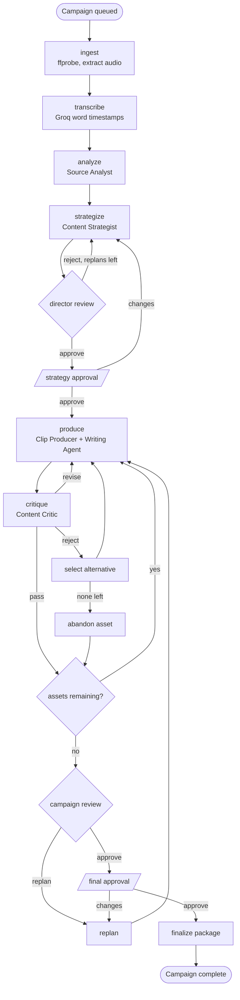

# Chorus

Chorus turns one long-form podcast and a growth objective into a multi-platform campaign. Seven specialized agents decide what is worth making, produce grounded written assets and vertical clips, critique their own output, revise or replace weak work, then review the campaign as a portfolio.

## Local setup

Chorus is intentionally local-only for v1. It needs Node 24, a Supabase project, OpenRouter, Groq, and an ffmpeg build with libass:

```bash
brew install ffmpeg-full
/opt/homebrew/opt/ffmpeg-full/bin/ffmpeg -version
npm install
cp .env.example .env.local
```

Fill in `OPENROUTER_API_KEY`, `GROQ_API_KEY`, `NEXT_PUBLIC_SUPABASE_URL`, and `SUPABASE_SERVICE_ROLE_KEY`. The service role key is server-side only. Apply migrations to the linked Supabase project, then regenerate types:

```bash
npm run db:push
supabase gen types typescript --linked --schema public > lib/db/database.types.ts
```

Homebrew's regular `ffmpeg` package may not include the `ass` filter. Use `ffmpeg-full`, or set `FFMPEG_PATH` and `FFPROBE_PATH` to another build that includes libass. Source uploads remain under `STORAGE_DIR`; rendered clips are uploaded to the Supabase `assets` bucket and also retain a local render path for export.

Run the two processes in separate terminals:

```bash
npm run dev       # Next.js app on http://localhost:3000
npm run worker    # claims campaigns and runs the graph
```

The worker also has a bounded smoke-test mode:

```bash
npm run worker:once
```

Without a worker, campaigns remain queued. `STALE_CLAIM_AFTER_SECONDS` defaults to 90 and should remain comfortably above the 10 second heartbeat interval. A development `MODEL_OVERRIDE_ALL` can reduce model cost, but it must accept images because video clips use a vision inspection pass.

## Architecture

The Next.js app writes a queued campaign and the standalone worker claims it. All database access stays behind server routes or the worker. Agents use tools, and tools own database and media side effects.



`campaigns.current_node` is the durable resume point. Human gates queue an explicit resume node. The worker heartbeats its claim, and the SQL claim function safely reclaims active rows whose heartbeat is stale. Reclaimed work starts at the saved node and reuses durable transcripts, successful agent runs, reviews, and asset transitions before making a paid call again. Worker updates are fenced by `claimed_by` so an old process cannot mark a newly reclaimed campaign failed.

## Export and inspection

The final review is at `/campaigns/[id]/review`. After final approval and successful `finalize`, `GET /api/campaigns/[id]/export` streams a ZIP containing `campaign.md`, Markdown written assets, and only assets whose status is exactly `passed`. Rejected, abandoned, replaced, planned, generating, revising, and needs-review rows never enter the package. Clip files are added from validated paths beneath `STORAGE_DIR` without buffering the media into memory.

Clip inspection is intentionally modest and honest: silence detection, sampled frames for video sources, and transcript word timing. It is not true video understanding. Silence detection does most of the useful work. Audio-only sources skip frame sampling and the vision call, then render caption-card audiograms at 9:16 instead of pretending there is a talking-head video.

## Demo script

Use a short local recording or a podcast with a known weak segment. The full external-service run requires valid OpenRouter, Groq, Supabase, media, and ffmpeg credentials, so this repository does not fabricate an end-to-end demo result.

1. Start `npm run dev` and `npm run worker`.
2. Upload a video podcast, enter a growth objective, and build the campaign.
3. Watch the graph and timeline move from analysis to the strategy approval gate.
4. Approve the strategy and observe one asset at a time move through production and Critic review.
5. Show a real `REVISE` loop or rejected asset and its replacement if the input produces one.
6. Show the Campaign Reviewer scorecard and resolve final approval.
7. Open the final review, play a captioned vertical clip, and download the ZIP.

For local checks that do not call external services:

```bash
npm test
npx tsc --noEmit
npm run lint
npm run build
```

## Known limitations

- Center crop, not face tracking. Off-center speakers can be framed poorly.
- Inspection is silence detection plus sampled frames plus transcript timing, not video understanding.
- Audio-only sources produce caption-card audiograms, not talking-head clips.
- A single speaker is assumed. There is no diarization for multi-guest podcasts.
- There is no B-roll, music, advanced transition system, direct social publishing, scheduling, or analytics.
- This is a single-user local application with no auth. RLS is enabled with zero policies and all access goes through the server.
- Supabase's free tier can pause after inactivity. Unpause the project before a run if its database is sleeping.
- Real cost varies with source length, model choice, retries, and replans. Keep `CAMPAIGN_COST_CEILING_USD` set.
