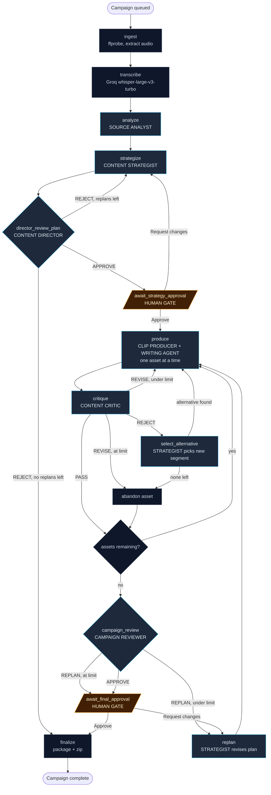

# Chorus architecture

Mirrors `MVP.md` section 6. **Changing `lib/graph/nodes.ts` means updating this diagram in the same commit**, and `components/AgentGraph.tsx` renders the same node set live.

**Build state:** Phase 6 complete. The executor runs through the first human gate, produces one asset at a time, critiques it, revises or replaces it when needed, and parks at the unbuilt `campaign_review` frontier for Phase 7.

---

## Two processes, one database

The Next.js app never runs the agent graph. It writes a campaign row with `status = 'queued'` and returns. The worker claims that row with `claim_campaign` (`select ... for update skip locked`), runs the graph, and writes progress back. A 20 minute campaign is therefore bounded by nothing in the HTTP layer.

```
Next.js app ──write──> campaigns(status='queued') <──claim── worker
     ^                          │                              │
     │                    agent_events                          │
     └────── SSE (id > cursor) ─┘ <───────── emit() ────────────┘
```

Resumability lives in `campaigns.current_node`, not in worker memory. A human gate sets `status = 'awaiting_*'` and returns `next: null`; the approve route flips the row back to `queued`; the worker picks it up where it stopped. A worker crash mid-campaign is recoverable for the same reason.

## Agent graph



LLMs decide content and scores at nodes. TypeScript decides which edge is taken. Every node returns `{ next, patch, reason }`.

## Layering

```
node ──> agent ──> lib/tools/ ──> database / ffmpeg / storage
                        │
                 lib/llm/structured.ts ──> OpenRouter
```

Agents call `lib/tools/` and nothing else. No agent file imports the Supabase client, and no agent file calls the AI SDK directly. Both rules exist so that every action an agent takes is logged to `agent_runs.tool_calls` and `agent_events` without anyone remembering to log it, which is what fills the live UI.

## Phase 5 decisions

**A boundary is a word fact, not a model fact.** The model proposes an absolute source span, but `snapClipBoundaries` constrains it to one selected segment, starts on a real word, ends 300 ms after the final included word, and enforces the campaign duration cap. The same function handles vision suggestions. A model cannot make ffmpeg seek outside the selected evidence or cut a word in half. The producer inspects the initial draft and permits at most two changed drafts; a repeated suggestion ends the loop rather than spending a third adjustment on identical media.

**Inspection branches on the probed database fact.** Video drafts run `silencedetect`, sample six chronological 512 px JPEGs, and send those frames plus opening word timings to `MODEL_VISION`. Audio drafts run silence and word-timing checks in code. `inspectClip` does not merely ask the model to ignore frames on audio: it never invokes the injected vision function, which the MP3 render test proves with a throwing spy. This is inspection, not video understanding, and events name the actual signals used.

**The final command is a correctness boundary.** Both render branches seek the source and set `-t` from the snapped span. Video scales and center-crops to 1080x1920; audio maps a generated 1080x1920 background to the source audio. Both burn one ASS file containing the three-second hook and word-highlight captions, encode H.264/AAC with faststart, then probe the result. Production refuses to save or upload a render whose measured duration differs from the requested span by more than 100 ms. The automated test exercises the real ffmpeg commands for synthetic video and MP3 fixtures.

**Caption burning requires libass.** Homebrew's regular `ffmpeg` 8.1.2 bottle does not include the `ass` filter even though the original prerequisite assumed it did. Phase 5 uses keg-only `ffmpeg-full`, and `.env.example` points to `/opt/homebrew/opt/ffmpeg-full/bin`. This was found by running the render test, not by inspecting a nominal version string.

**Only rendered clips leave local disk.** Drafts, frames, captions, and final scratch files live under `work/{campaignId}/assets/{planKey}`. The final MP4 is uploaded idempotently to the public Supabase `assets` bucket and its URL plus local relative path are saved atomically with the asset's `needs_review` transition. Source media remains local and never approaches Supabase's 50 MB object limit.

## Phase 6 decisions

**The Critic does not own control flow.** `content_critic` returns six 1-to-10 scores and actionable feedback for one asset. TypeScript routes the result: any score at or below 3 is `REJECT`, an average of at least 7 with no score below 5 is `PASS`, and everything else is `REVISE`. The decision is stored in `reviews`, so a worker retry can apply the same edge without buying a second judgement.

**Production is one asset at a time.** `produce` selects the first planned, revising, or in-progress row that is not terminal, then returns to `critique` as soon as that row is durable. A worker crash after a model call can reuse the successful `agent_runs` output, and a crash after rendering sees `needs_review` rather than generating the same asset again. This is the loop the dashboard can show rather than a bulk production phase hidden behind one status.

**Revision credits are separate from planned asset credits.** A Critic revision increments `assets.revision_count` before production and reserves one additional credit through `begin_asset_revision`, inside Postgres. Re-entering while the asset is already `generating` is free. `MAX_REVISIONS_PER_ASSET` is checked in the graph, not in a prompt; when the limit is reached the asset becomes `abandoned` and is excluded from the eventual package.

**Rejecting preserves history.** A rejected row is never overwritten. `select_alternative` asks the Strategist to choose from segments unused by every existing asset, replaces the rejected plan entry with a suffixed key such as `asset_1_alt_1`, and lets `produce` materialize the new row. If no candidate remains, the rejected row is abandoned. Rejected and abandoned rows stay visible in the dashboard and their reviews remain auditable.

## Phase 4 decisions

**Grounding is a runtime property.** The Writing Agent sees verbatim transcript excerpts, not segment summaries. It also receives overlapping 24-word quote options generated deterministically from those excerpts, which gives weaker development models short spans they can copy without changing transcription grammar. Its output maps every factual claim to a `source_quote`, and TypeScript accepts a quote only when it occurs in one of the selected excerpts after normalizing case and whitespace. A semantic grounding failure gets one full regeneration with the exact bad claims and quotes named. A second failure stops the node, so an ungrounded asset never reaches `needs_review` or the UI as plausible finished work.

**Schema repair and editorial validation are different runs.** `callStructured` repairs malformed shape inside one `agent_runs` row. Grounding and platform lengths are runtime checks: the development model repeatedly ignored Zod string maxima because strict provider schemas are unavailable, while an exact failure such as `tweet 2 is 314 characters` produced a useful correction. A schema-valid but ungrounded or overlong asset therefore creates a separate regeneration row. The history shows whether the model failed to format an answer or failed the product's correctness contract.

**Credits and generation status move atomically.** `begin_asset_generation` locks both rows, checks the fixed cost and campaign budget, increments `credits_spent`, and changes the asset from `planned` to `generating` in one transaction. Calling it again while the asset is already `generating` is free. A worker can die anywhere after that point without charging the planning credits twice when production resumes.

**Production sweeps assets temporarily.** The final graph alternates `produce` and `critique` one asset at a time, but the Critic does not exist until Phase 6. Phase 4 initially swept written assets; Phase 5 extends the sweep across clips, reusing any durable `needs_review` output after a crash. Once every planned output exists, production advances to the honest unbuilt `critique` frontier. Phase 6 removes the sweep in favor of the diagram's final loop.

## Phase 3 decisions

**The plan is schema-valid first and campaign-valid second.** Zod checks the output shape. TypeScript checks relationships the schema cannot know: fixed per-type credit costs, total budget, enabled platforms, source segment membership, unique stable plan keys, the hard asset cap, and short-video duration. A relationship failure is sent back once with the exact violations. The prompt explains arithmetic, but only code is trusted to enforce it.

**A paid decision is graph memory.** Strategies are versioned rows. If the worker crashes after saving one but before leaving `strategize`, the node reuses it instead of paying to recreate it. The Director's successful structured output already lives in `agent_runs`; `getDirectorReview` treats that as the durable decision record, so a crash after review does not buy the same review twice. A Director or human rejection is the only reason the Strategist creates the next version.

**Replan accounting is tied to strategy versions.** Initial strategy v1 exists before any replan. A rejection of v1 consumes replan 1 and creates v2; a rejection of v2 consumes replan 2 and creates v3. Comparing `replan_count` with the reviewed version makes the patch idempotent when a worker dies after incrementing the counter but before traversing the edge. The limit stays in TypeScript, never in a prompt.

**The gate route chooses a resume node.** The gate itself leaves `current_node = 'await_strategy_approval'`. Approval must queue `produce`, while a change request must queue `strategize` after its feedback is durable. Flipping only `status` back to `queued` would make the worker re-enter the gate and pause forever. Human feedback is written as an event before the campaign becomes claimable, which lets the Strategist read the exact request without adding transient worker memory.

## Phase 2 decisions

**Map-reduce is forced by more than context length.** A 90 minute episode is 120k to 180k tokens, so the map pass exists for the obvious reason. But it would still exist on a 1M context model, because two of the analyst's judgements are structurally impossible inside a single window: `novelty_score` is meaningless relative to one eight-minute slice, and a topic straddling a window boundary can only be recognised as one topic by something that sees both. So novelty is absent from the map schema entirely, and the reduce pass, the only stage that sees the whole candidate pool, owns both. It returns `candidate_ids` per segment, which makes a merge auditable against the candidates it claims to combine.

**Windows overlap by 60 s, and the last one is folded away.** Without overlap, a topic on a boundary is truncated in both windows; with it, anything shorter than the overlap is seen whole by at least one. The duplicate that creates is the reduce pass's job, and it is the cheap direction of the trade: a duplicate is recoverable, a bisected topic is not. A final window that adds less new material than the overlap is folded into its predecessor instead of emitted, because it is a paid call that can only produce duplicates. **The fold appends its unseen words to the previous window**; the first version only moved the boundary, which silently dropped the last twenty seconds of the episode from analysis. A unit test caught it, which is the argument for `planWindows` being pure.

**Schema strictness is decided per constraint.** Strict schema mode is not in effect through OpenRouter (Phase 0 finding, below), so every constraint in a Zod schema is a constraint the model may miss and the repair pass then pays a round trip to fix. Score *ranges* are worth that: a `standalone_score` of 7 is a semantic error and the retry genuinely corrects it. Array and string *lengths* are not: `.slice(0, 3)` on `potential_hooks` costs nothing. Code clamps the scores anyway, because `segments.energy` carries a `between 0 and 1` check constraint and one stray value would fail the whole insert and take the node down with it.

**The model proposes boundaries; TypeScript disposes.** `snapToWords` pulls each span onto real word edges and clamps it inside the transcript, so a hallucinated timestamp can never reach an ffmpeg `-ss`. `dropDuplicates` measures overlap against the *shorter* segment, so a 20 s aside living inside a 90 s answer counts as fully overlapping and is dropped. It is not a second topic. The 20-segment cap is applied to a list sorted by strength, weighted toward `standalone_score`, because everything this system produces is consumed with zero context by someone scrolling.

**Three map calls in flight.** Sequential is ~13 round trips on a 90 minute episode; unbounded is a provider rate limit. A single window failing is tolerated and emits a `warn` naming which minutes are missing, but losing more than a third of the windows fails the node: that is not a degraded analysis, it is a different episode. `CostCeilingExceededError` is rethrown rather than collected, since letting the other two in-flight windows continue spends money the campaign has already been told to stop spending.

**`analyze` is skipped when segments exist.** It is the first genuinely expensive node, and a campaign resumed after a crash further downstream must not pay for it twice. `saveSegments` deletes before inserting rather than upserting, because a re-analysis produces different segments rather than new versions of the old ones, and a partial old run interleaved with a complete new one is indistinguishable downstream.

## Phase 1 decisions

**The unbuilt frontier.** `lib/graph/nodes.ts` registers only the nodes that exist. Reaching an unregistered one parks the campaign: `current_node` keeps pointing at it, `status` becomes `complete`, and a `level:'warn'` event says the node is not built yet. Everything before it genuinely succeeded, and the moment that phase lands the same campaign resumes exactly there. Registering stubs instead would be worse — a node returning a plausible empty result makes an unbuilt phase look like a working one. This branch deletes itself: once every node has an implementation it is unreachable.

**Upload is a raw body, not multipart.** `request.formData()` buffers the entire upload in memory and a 90 minute recording is 1 to 3 GB. The browser sends the `File` as the request body with the name in an `x-filename` header, and the route streams it to disk at constant memory. The name on disk is always `source{ext}` — a filename that came from a browser never becomes a path component.

**The upload lands before the campaign row exists**, in `uploads/_pending/{token}/`. `POST /api/campaigns` inserts the row, renames that directory to the campaign id, and only then sets `status='queued'`. The row is inserted as `'ingesting'` for those few milliseconds because `'queued'` is the only signal the worker's claim query reads: enqueueing first would let a worker claim a campaign with no `source_path` and fail it instantly. Renaming beats copying — it is atomic on one filesystem and cannot half-move 3 GB.

**Groq transcription cost is estimated, not reported.** Unlike OpenRouter, the transcription API returns no cost figure, so `transcribe` charges `USD_PER_AUDIO_HOUR` (list price, read 2026-08-09) times audio hours. If Groq reprices, the campaign total drifts low rather than reporting a false zero.

**The transcript is saved before the cost is charged.** Crossing the ceiling must fail the run, but discarding a transcript that was already paid for would mean paying for it again on the retry. `transcribe` also returns early when a transcript already exists, so a campaign resumed after a crash in a later node does not re-transcribe.

**Chunk offsets are planned starts, not summed durations.** `-c copy` lands on the nearest MP3 frame boundary, so each slice can begin up to ~26 ms early. Seeking every chunk independently from the source keeps that error bounded per chunk; accumulating measured durations would let it compound across all nine chunks of a 90 minute episode. `mergeChunks` and `planChunks` are pure and unit-tested, and `scripts/verify-chunking.ts` proves the arithmetic is actually wired to the slicing by transcribing one real file both ways and comparing the timelines (measured drift: 0.70 s, which is Whisper run-to-run wobble; a dropped offset would show tens of seconds).

**An attached picture is not a video stream.** Cover art inside an MP3 is a video stream to `ffprobe`, and cropping a still image to 9:16 produces a frozen frame. `probe()` ignores streams with `disposition.attached_pic`, so `has_video_stream` means motion.

## Phase 0 decisions

**Structured output (MVP section 7.0). Spike run 2026-08-09 against `google/gemini-2.5-flash-lite` through OpenRouter; results below. `scripts/spike-structured-output.ts` has served its purpose and is deleted.**

The decision: `generateText({ output: Output.object({ schema }) })`, parsed value read from `result.output`. Both APIs work through OpenRouter (`generateObject` returned a valid `result.object` too), so this went to the non-deprecated one.

What the spike established:

| Question | Answer |
|---|---|
| Does `Output.object` return clean typed data? | Yes, on `result.output`, schema-valid. |
| Does `generateObject` still work? | Yes. Not used; `Output.object` is the forward path. |
| Is strict schema mode in effect? | **No.** `result.warnings` was empty but a `z.string().max(40)` was violated on the first attempt, so constraints are not enforced server-side. **The repair pass is a live path, not a safety net.** |
| Does OpenRouter report real cost? | Yes, at `providerMetadata.openrouter.usage.cost` (also `costDetails.upstreamInferenceCost`). Pinned by a test. |

**The repair pass was broken when first written, and the spike is what caught it.** A schema violation surfaces as `NoObjectGeneratedError("response did not match schema")`, with the actual Zod issues two levels down the `cause` chain inside a `TypeValidationError`. Feeding that top-level sentence back gave the retry nothing to act on and produced an identical second failure. `describeError` now walks the `cause` chain, and the retry prompt also includes the raw text the model produced. Verified both ways afterwards: a `max(40)` hook fails then succeeds on retry, a `max(12)` hook fails twice and the node fails loudly.

**Failed attempts are not charged.** The SDK's error carries `usage` but no provider metadata, so there is no cost figure to record. Each one emits a `level:'warn'` event naming the gap, so the campaign total is a known undercount rather than a silent one.

**Cost ceiling before agents.** `add_campaign_cost` increments `campaigns.cost_usd` in Postgres so two concurrent calls cannot both read a stale total and slip past the ceiling together. Crossing `CAMPAIGN_COST_CEILING_USD` throws `CostCeilingExceededError` and fails the run. This exists before any agent does, on purpose.

Two bugs in it were found by exercising it rather than by reading it, both worth remembering:

- `campaigns.cost_usd` was `numeric(10,4)` per MVP section 5. A real call cost `$0.0000174` and rounded to `$0.0000`, so the total stayed at zero forever and the ceiling was unreachable. Now `numeric(12,6)`, matching `agent_runs.cost_usd` (migration `0004`).
- `chargeCampaign` throws from *inside* `callStructured`'s try block, so `CostCeilingExceededError` was caught by the generic handler, treated as a schema failure, and **retried** — a runaway that spent more money on an already-overdrawn campaign, which is the exact failure the ceiling exists to prevent. It is now rethrown before any retry logic runs.

**Model selection (MVP open item 3).** All three IDs verified against `https://openrouter.ai/api/v1/models` on 2026-08-09: `anthropic/claude-sonnet-4.5` ($3/$15 per Mtok), `google/gemini-2.5-flash` ($0.30/$2.50), both multimodal.

`MODEL_OVERRIDE_ALL` points every role at one model for development, currently `google/gemini-2.5-flash-lite` ($0.10/$0.40, 1M context, accepts images). It leaves `MODEL_REASONING`/`FAST`/`VISION` intact as the real configuration, so switching back for a demo is one commented line. **Anything set there must accept images**, or the Clip Producer's vision pass breaks on video sources. The worker prints the override at boot so it cannot silently degrade a demo, and `agent_runs.model` records the model per call.

**Schema source of truth** is `supabase/migrations/`, not a checked-in `lib/db/schema.sql`. `lib/db/database.types.ts` is generated from the live database with `supabase gen types typescript --linked --schema public`; regenerate it after every migration.

**TypeScript 6, not 7.** `typescript-eslint` throws on load under TS 7.0 and takes `eslint-config-next` with it, so TS 7 means no linting at all. `MVP.md` section 2 has the full reasoning. The TS 7 constraints are still observed (no `baseUrl`, `moduleResolution: bundler`) so going back is a version bump.

**Claim semantics.** `claim_campaign` moves the row out of `'queued'` immediately, because `'queued'` is the only signal that a campaign is unclaimed. It sets `'ingesting'` provisionally; the executor overwrites `status` and `current_node` as it enters its first node, which for a resumed campaign is wherever it left off. Nothing reclaims a campaign whose worker died mid-run yet: heartbeats are written, but automatic stale-claim recovery is Phase 9.
